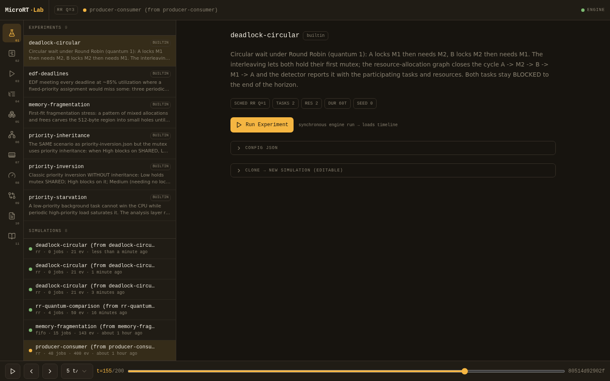
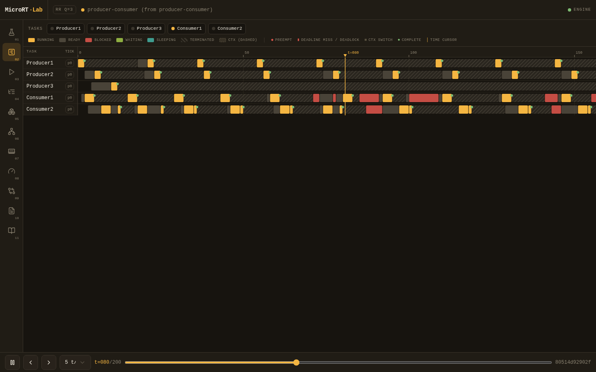
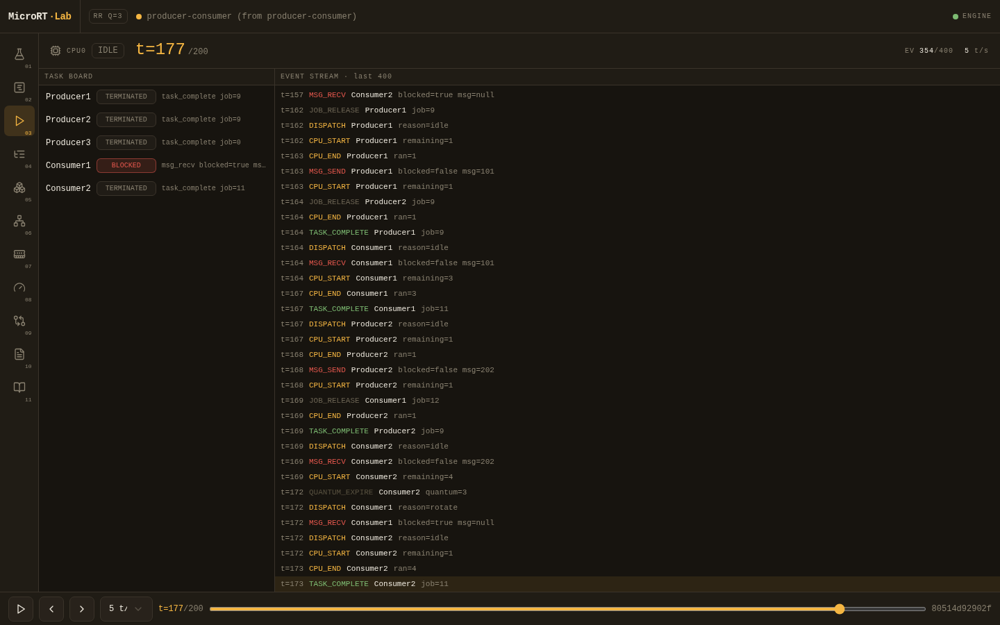
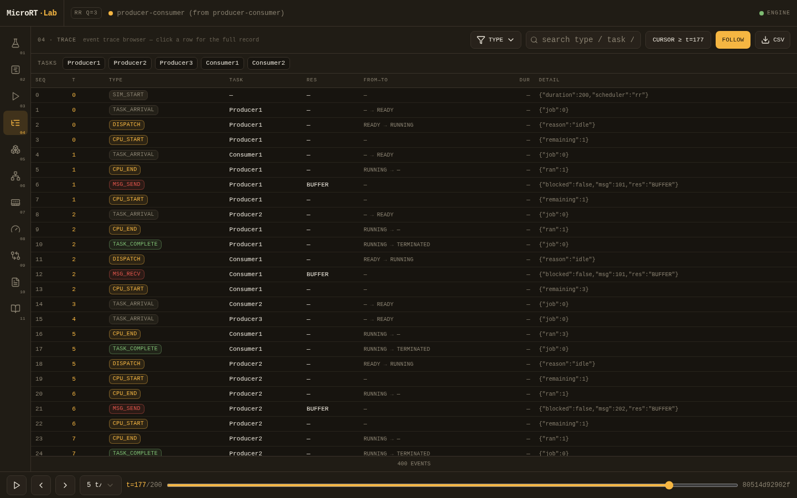
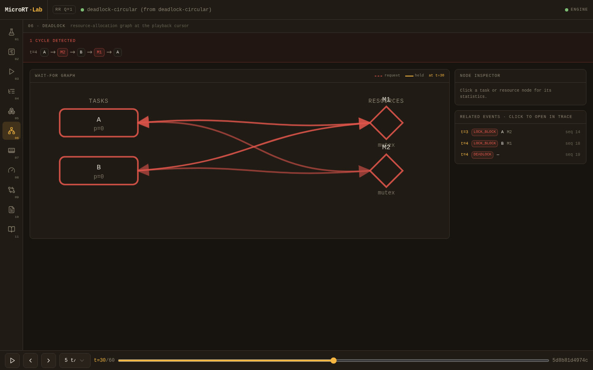
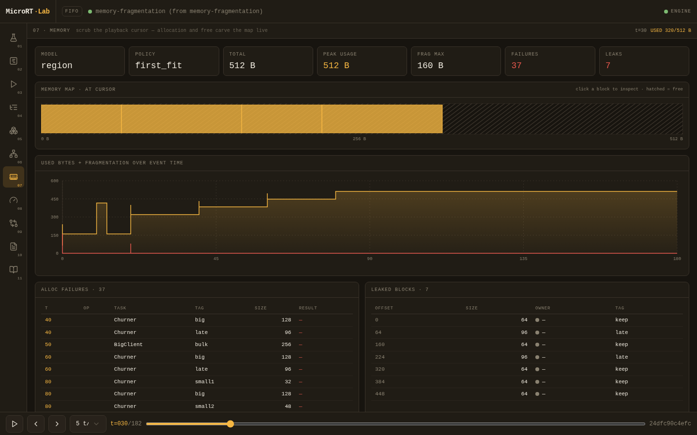
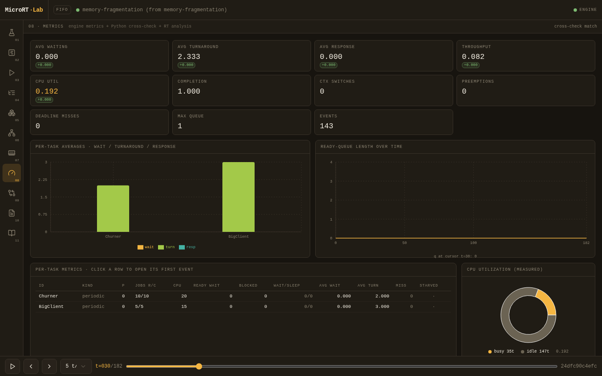
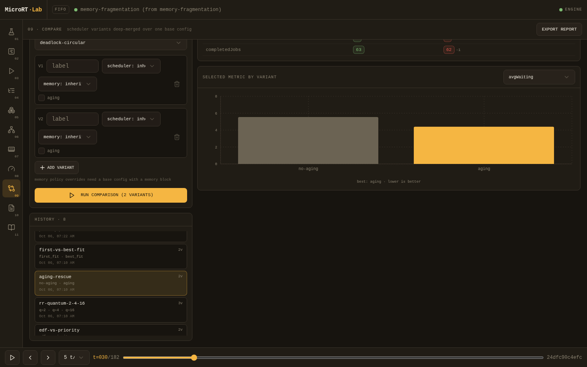
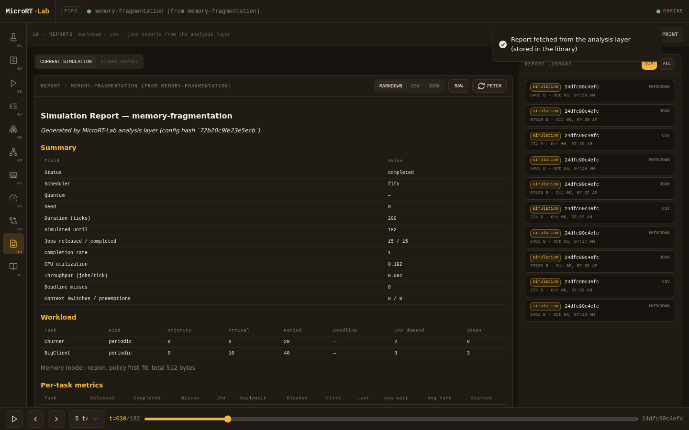

# MICRORT-LAB

Deterministic Real-Time Operating System & Scheduling Laboratory

Copyright © 2026 Parsa Fathi — Apache-2.0 — <https://github.com/ParsaFathii/MICRORT-LAB>

**Documentation:** [English](#documentation) · [فارسی](docs/fa/README_FA.md)

---

## What MicroRT-Lab is

MicroRT-Lab is a **deterministic discrete-event simulation laboratory for operating-system
scheduling and synchronization concepts**. You describe a workload in a JSON configuration
(tasks, release patterns, a program of steps per job, shared resources, a scheduler, optional
memory model), the C++ engine executes it tick-by-tick, and you get back a complete,
reproducible record: an event trace, a Gantt segment timeline, per-task accounting,
aggregate metrics, detected deadlocks, and memory allocator statistics. A Python analysis
layer manages experiments, recomputes metrics as a cross-check, compares scheduler variants
and generates reports; a web workstation visualizes the trace with a Gantt timeline,
playback, resource state, deadlock graphs and memory maps.

What it is **not**:

- **Not a production OS kernel.** The C `kernel/` layer is a small, fixed-capacity library of
  kernel-style primitives (TCBs, ready queue, mutex, semaphore, message queue, event flags,
  memory allocator) built for simulation, not for booting hardware.
- **Not a wall-clock real-time system.** There is no timer interrupt, no actual CPU
  scheduling, and no latency guarantee. "Real-time" here refers to the *scheduling theory*
  being modeled (deadlines, RM/EDF, utilization bounds), executed in simulated integer
  ticks.

## The problem it solves

Studying CPU scheduling and synchronization with live demos is hard to do reliably:

- A wall-clock demo (real threads on a real OS) depends on the host scheduler, cache state
  and machine load — rerunning the "same" demo produces different interleavings every time,
  so an interesting event (a priority inversion, a deadlock, a deadline miss) may simply not
  occur in front of the class.
- Textbook Gantt charts show the *outcome* but hide the *mechanics*: which event triggered
  the preemption, which waiter was woken first, how the queue evolved.

MicroRT-Lab replaces this with a discrete-event simulation: **same config + same seed →
byte-identical result document** (modulo the engine's own wall-clock timing field). Every
run can be replayed, filtered, measured, cross-checked and compared. The cost of determinism
is fidelity to real hardware: context switches are a fixed tick cost, I/O is a pure delay,
and there is one simulated CPU.

## The workstation

All screenshots below are from the running application (real experiment data, no mockups):

| View | What it shows |
| --- | --- |
|  | Experiment library, config detail, run, simulation history |
|  | Gantt timeline: state lanes, markers, cursor, inspector |
|  | Playback: task board, CPU state, streaming event feed |
|  | Full event trace with filters, search, CSV export |
|  | Resource-allocation graph with the detected cycle |
|  | Memory map replayed at the cursor, fragmentation chart |
|  | Metric tiles with Python cross-check, RT analysis |
|  | Scheduler comparison matrix with best-per-metric |
|  | Generated markdown/CSV/JSON reports |

Original diagrams: [architecture](docs/assets/diagram-architecture.svg) ·
[simulation flow](docs/assets/diagram-simulation-flow.svg) ·
[task lifecycle](docs/assets/diagram-task-lifecycle.svg) ·
[scheduler pipeline](docs/assets/diagram-scheduler-pipeline.svg).

## Architecture

```
                 ┌──────────────────────────────────────────┐
                 │  experiment config  (JSON, micrort-      │
  experiments/ ─▶│  config/1)  +  seed                     │
                 └───────────────────┬──────────────────────┘
                                     │  scripts/build-native.sh
┌────────────────────────────────────▼─────────────────────────────────────┐
│  kernel/   C11  — task control blocks, ready queue, mutex (hand-off +     │
│            priority inheritance), counting semaphore, message queue,      │
│            event flags, region/pool memory allocator. Fixed capacities,  │
│            no dynamic allocation, no engine/UI coupling.                 │
├───────────────────────────────────────────────────────────────────────────┤
│  engine/   C++20 — discrete-event core: event queue, program interpreter  │
│            (13 step ops), 8 schedulers, preemption + context-switch cost, │
│            RAG deadlock detector, aging, trace/gantt/metrics recorder.    │
│            CLI: micrort-engine (run | validate | schema | selftest).      │
├───────────────────────────────────────────────────────────────────────────┤
│  services/api/  Python 3.12 + FastAPI — experiment management,            │
│            simulation control (subprocess), metric recomputation          │
│            cross-check, RM/EDF feasibility analysis, comparisons,         │
│            reports (markdown/CSV/JSON). SQLite storage.                   │
├───────────────────────────────────────────────────────────────────────────┤
│  src/      TypeScript + React (Next.js 16) — "simulation workstation":   │
│            Gantt timeline with zoom/pan, playback transport, trace       │
│            table, resource state, deadlock RAG, memory map, metrics      │
│            charts, comparison matrix, reports.                           │
└───────────────────────────────────────────────────────────────────────────┘
   result document (JSON, micrort-result/1) ──▶ analysis ──▶ visualization
```

Why one language per layer:

- **C for the kernel layer.** The low-level task/synchronization model is exactly the kind of
  code that benefits from C: small, explicit, fixed-capacity arrays instead of dynamic
  containers, `extern "C"` boundaries, and result codes instead of exceptions. The engine
  links it directly — the simulated kernel *is* the C code, so the semantics you study are
  the semantics the C functions implement.
- **C++ for the engine.** The event queue, program interpreter, scheduler policies, JSON I/O
  (vendored nlohmann/json) and result serialization need RAII, destructors and containers
  with strict ordering guarantees. The engine avoids unordered containers entirely so
  output is byte-identical across runs.
- **Python for the analysis layer.** Experiment management, subprocess control, pydantic
  validation mirroring the engine grammar, metric recomputation and report generation are
  I/O-and-plumbing work where FastAPI, pydantic and pytest are the right tools.
- **TypeScript/React for the workstation.** The UI visualizes trace data. It **never computes
  scheduler results** — every number shown comes from the engine result document or the
  Python analysis, so the diagrams cannot drift from the simulation.

Data flow, end to end:

```
config JSON ──▶ micrort-engine run ──▶ result JSON (trace, gantt, metrics,
                    (subprocess)        deadlocks, memory, anomalies)
                                            │
                                            ▼
                        FastAPI /api/v1/*  (store, recompute, compare, report)
                                            │
                                            ▼
                        web workstation    (timeline, playback, RAG, memory map)
```

## Concepts supported

**Task model.** Three kinds: `aperiodic` (one job at `arrival`), `periodic` (a job every
`period` ticks, optional jitter driven by the seeded PRNG), `sporadic` (jobs at explicit
release instants). Priorities −100..100 (higher = more urgent). Optional relative deadlines
per task. Six task states: `READY`, `RUNNING`, `BLOCKED` (resource wait), `WAITING` (I/O),
`SLEEPING` (timed sleep), `TERMINATED` (job finished; periodic tasks continue releasing).

**Program steps (13 ops).** `cpu`, `io` (timed delay with a device label), `sleep`, `lock`,
`unlock`, `wait`/`signal` (semaphore), `send`/`recv` (message queue), `evwait`/`evset`
(event flags), `alloc`/`free` (memory model).

**Schedulers (8).** `fifo`, `rr` (quantum, default 4), `priority` (non-preemptive),
`priority_p` (preemptive), `sjf`, `srtf`, `rm` (static priorities from period), `edf`
(dynamic, earliest absolute deadline). Preemption switches only on a *strictly* more urgent
candidate — no thrashing on ties. A configurable `contextSwitchCost` (0..10 ticks) is
charged on every CPU handover and shown on the timeline.

**Synchronization.** Mutex with direct hand-off to the highest-priority waiter on unlock and
optional **priority inheritance** (transitive along chains of inherit mutexes, traced as
`LOCK_INHERIT`/`LOCK_UNINHERIT`); counting semaphore with hand-off semantics; bounded
message queue (blocks on full/empty); event flags with `any`/`all` mask modes. Relock by
the mutex owner is rejected (`MRT_ERR_BAD_STATE`) — it is a self-cycle in the
resource-allocation graph.

**Deadlock detection.** The engine maintains a resource-allocation graph (RAG) and reports
cycles: `deadlocks[]` carries the cycle, the involved tasks/resources and the detection
tick; `DEADLOCK` trace events and the UI's RAG view highlight the circular wait.

**Priority inversion & inheritance.** The same workload can be run with a plain mutex and
with `protocol: "inherit"` and the results compared — see the experiments table below
(High blocked 34 ticks without inheritance vs 9 with).

**Starvation & aging.** A configurable aging policy (effective priority +1 every `interval`
ticks in READY, capped) can rescue low-priority tasks under preemptive priority scheduling.
The starvation heuristic (READY ≥ 100 ticks with no CPU progress while others ran) is
reported per task; the analysis layer re-applies it with a configurable threshold.

**Memory models.** `region` (variable-size allocations, first/best/worst-fit policies,
adjacent free blocks coalesce, fragmentation tracked at every alloc/free event) and `pool`
(fixed-size blocks, internal fragmentation). Failures, leaks (allocations live at job end)
and a per-event fragmentation series are reported.

## Experiments

Nine canonical experiment configurations ship in [`experiments/`](experiments/README.md)
and are served as the built-in library by the API. Measured numbers below come from running
each experiment with the current engine:

| Experiment | Demonstrates | Observable outcome |
|---|---|---|
| `rr-quantum-comparison.json` | Round Robin quantum sensitivity | 4 equal-priority tasks, quantum 4: 11 context switches, avgResponse 5.25 — clone with quantum 2/8/16 in the Compare view to see the response/switch trade-off |
| `priority-starvation.json` | starvation under `priority_p` | `BG` (prio 1) flagged `starved` with 145 ticks READY wait at U≈0.98 while HOT1..3 run; the aging variant (interval 4, cap 22) cuts the wait to 96 ticks |
| `priority-inversion.json` | priority inversion, plain mutex | High BLOCKED 34 ticks while Medium (middle priority) preempts Low, the mutex holder |
| `priority-inheritance.json` | same scenario, `protocol: "inherit"` | Low boosted via `LOCK_INHERIT`; High blocked 9 ticks instead of 34 |
| `producer-consumer.json` | bounded buffer via msgq | producers/consumers alternate through a bounded queue; blocked hand-offs visible in the Resources view; no deadlock |
| `deadlock-circular.json` | circular wait | `deadlocks[]` non-empty at t=4: cycle A→M2→B→M1→A, both tasks BLOCKED to the horizon (57/56 ticks) |
| `memory-fragmentation.json` | region allocator, first-fit | 37 alloc failures, 7 leaks, external fragmentation peaking at 160 B of 512 B total; best-fit variant comparable in the UI |
| `edf-deadlines.json` | EDF meeting deadlines at U≈0.92 | 24/24 jobs completed, 0 deadline misses at utilization 0.923 — above the 3-task fixed-priority bound 0.7798 |
| `rate-monotonic.json` | RM + utilization bound | periods 12/24/48, U = 0.5625 < LL bound 0.7798; 14/14 jobs, 0 misses; the analysis layer reports the bound next to the measurement |

## Installation

Prerequisites:

- **C/C++ toolchain** — gcc 14+ or clang, with C11 and C++20 support
- **CMake ≥ 3.16**
- **Python 3.12+** (FastAPI, uvicorn, pydantic, plus pytest/ruff for development)
- **Node 20+ or bun 1.1+** for the web workstation (bun is used in development)

Build the kernel + engine:

```bash
bash scripts/build-native.sh
# binary: engine/build/engine/micrort-engine
```

Run the analysis API (127.0.0.1:3031):

```bash
cd services/api
python3 -m uvicorn app.main:app --host 127.0.0.1 --port 3031
# or: bash run-dev.sh   (adds --reload)
```

Run the web workstation (port 3000):

```bash
bun install
bun run dev
```

The API needs the engine binary built first; if it is missing the service still starts but
run endpoints answer 503 (see [Troubleshooting](#troubleshooting)).

**Sandbox/dev environment note:** in the development sandbox the web app reaches the API
through a gateway using relative paths `/api/v1/...?XTransformPort=3031` — the direct base
URL is `http://127.0.0.1:3031`. Details, ports and wrapper conventions are documented in
[docs/dev/SETUP.md](docs/dev/SETUP.md).

## Usage

### Engine CLI

```console
$ engine/build/engine/micrort-engine validate --config experiments/rate-monotonic.json
{"valid":true,"configHash":"a48b326b378f504c"}          # exit 0

$ engine/build/engine/micrort-engine run --config experiments/edf-deadlines.json --out /tmp/r.json
run: edf-deadlines status=completed events=186 ticks=117   # stderr; result JSON written to --out

$ engine/build/engine/micrort-engine schema
{"config":"micrort-config/1","result":"micrort-result/1",
 "schedulers":["fifo","rr","priority","priority_p","sjf","srtf","rm","edf"],
 "steps":["cpu","io","sleep","lock","unlock","wait","signal","send","recv","evwait","evset","alloc","free"]}

$ engine/build/engine/micrort-engine selftest
{"checks":54,"selftest":"ok"}
```

A validation failure exits with code 2 and a JSON error on stderr:

```console
$ engine/build/engine/micrort-engine validate --config bad.json
{"valid":false,"details":["missing required field 'name'","missing required field 'duration'"]}
```

Exit codes: 0 success, 2 validation error, 3 runtime failure. `run` accepts `-` to read
config from stdin / write the result to stdout.

### Web walkthrough

1. **Workbench (1)** — the experiment library lists the 9 built-ins plus your saved
   simulations. Pick `priority-inversion`, press **Run Experiment**; the run is synchronous
   and the completed result loads into the workstation.
2. **Timeline (2)** — the Gantt view: one lane per task, state-colored segments (amber
   RUNNING, red BLOCKED, green WAITING/I/O, teal SLEEPING, hatched TERMINATED, dashed
   context-switch zones), markers for PREEMPT / CONTEXT_SWITCH / DEADLINE_MISS / DEADLOCK /
   TASK_COMPLETE. Wheel-zoom anchored at the pointer, drag-pan, click a segment or marker
   for the event inspector.
3. **Playback** — the transport bar (bottom, global): space = play/pause, ←/→ = step ±1
   tick, speed 1–50 t/s, scrubber. The **Live console (3)** shows the event stream at the
   cursor with per-task state LEDs.
4. **Resources (5) / Deadlock (6)** — resource state *at the cursor* (mutex owner/waiters,
   semaphore count, queue contents, flag bits) replayed from the trace; the RAG view draws
   the wait-for graph and highlights cycles.
5. **Compare (9)** — run the same base config under variants (scheduler, quantum, memory
   policy, aging) side by side; the matrix highlights best/worst per metric. Presets
   included: RR quantum 2/4/16, aging rescue, EDF vs priority_p, first vs best fit.
6. **Reports (10)** — fetch the simulation report as markdown/CSV/JSON; comparison reports
   render per-variant metric tables.

### API examples

```bash
# health (engine availability, cached 30 s)
curl -s http://127.0.0.1:3031/api/v1/health
# → {"status":"ok","engine":{"available":true,"binary":"...","info":{...}}}

# run a built-in experiment (synchronous)
curl -s -X POST http://127.0.0.1:3031/api/v1/experiments/rr-quantum-comparison/run
# → {"id":"333e411fe594","status":"completed","scheduler":"rr","taskCount":4,
#    "simulatedUntil":51,"configHash":"a48b326b378f504c", ...}

# trace (filter by type/task, paginated, sorted by (t, seq))
curl -s "http://127.0.0.1:3031/api/v1/simulations/333e411fe594/trace?limit=2"
# → {"id":"333e411fe594","items":[{"seq":0,"t":0,"type":"SIM_START",...},
#    {"seq":1,"t":0,"task":"T1","type":"TASK_ARRIVAL","to":"READY",...}],
#    "total":59,"limit":2,"offset":0,"unfilteredTotal":59}

# metrics: engine values + Python recomputation + deltas (cross-check)
curl -s http://127.0.0.1:3031/api/v1/simulations/333e411fe594/metrics
# → {"engine":{"avgWaiting":24.0,"cpuUtilization":0.941,"ctxSwitches":11,...},
#    "recomputed":{...},"deltas":{...},"match":true,"tolerance":0.001}

# compare two schedulers on one base config
curl -s -X POST http://127.0.0.1:3031/api/v1/comparisons \
  -H 'Content-Type: application/json' \
  -d '{"experimentId":"edf-deadlines","variants":[{"label":"priority_p","scheduler":{"type":"priority_p"}},{"label":"edf","scheduler":{"type":"edf"}}]}'
# → {"id":"132f7747a442","baseSource":"experiment:edf-deadlines","variantCount":2,
#    "variants":[...],"results":[...],"bestPerMetric":[...]}
```

Full endpoint table, error formats and merge semantics: [`services/api/README.md`](services/api/README.md).
The exact config/result JSON contract: [`docs/spec/SIMULATION_SCHEMA.md`](docs/spec/SIMULATION_SCHEMA.md).
Interactive OpenAPI docs at `http://127.0.0.1:3031/docs`.

## Testing

| Suite | Command | Result |
|---|---|---|
| kernel + engine (C) | `ctest --test-dir engine/build` | 11/11 test suites pass — 5 kernel suites (`test_task` 220 checks, `test_queue`, `test_sync` 588 checks, `test_mem` 82 checks, `test_timer` 175 checks) + 6 engine suites (`test_config`, `test_scheduler`, `test_cli`, `test_simulation`, `test_trace_gantt`, `test_metrics`); `micrort-engine selftest` = 54 checks |
| Python API | `cd services/api && python3 -m pytest` | 97 tests pass (uses the real engine binary: lifecycle, trace filters, determinism, stop-mid-run, 422/502/503 normalization, metric cross-check, comparisons) |
| Python lint | `python3 -m ruff check app tests` | clean |
| Web | `bun run lint` | clean (eslint; build dirs ignored) |

Every subsystem in this repository was built implement→test→fix→retest; the numbers above
are from the current tree.

## Performance

Measured on the current tree (single run, release build):

```console
$ time engine/build/engine/micrort-engine run --config experiments/edf-deadlines.json --out /dev/null
run: edf-deadlines status=completed events=186 ticks=117
real 0m0.002s
```

- All 9 canonical experiments complete in **2–3 ms of process wall time** each; the engine's
  internal `wallMicros` for a 186-event run is ~100 µs (the rest is process startup + JSON
  I/O).
- Result document sizes for the canonical experiments: **6 KB (21 events)** for
  `deadlock-circular` up to **72 KB (400 events)** for `producer-consumer`.
- Trace cap: the engine stops and reports `status: "stopped"` when the document would
  exceed **500 000 trace events**; the horizon is 100 000 ticks.

Engine runs are cheap enough that the synchronous one-run-per-request API design (see
[Limitations](#limitations)) is not a bottleneck for lab-sized workloads.

## Determinism

**Guarantee:** identical config + seed → byte-identical result document, with one exception:
`wallMicros` (the engine's own execution-time measurement) is excluded from equality.
Verified by running the same config twice and comparing: the only differing bytes are the
`wallMicros` value (95 µs vs 103 µs in the test run). A pytest in the API suite asserts the
same property through the subprocess wrapper, and the engine's C++ side avoids unordered
containers entirely — all output paths iterate declaration order or ordered maps.

How it is achieved (summary of the rules in
[`docs/spec/SIMULATION_SCHEMA.md`](docs/spec/SIMULATION_SCHEMA.md) §Determinism):

1. Time advances event-to-event; no wall-clock input.
2. The `seed` drives a xoshiro256\*\* PRNG used *only* for periodic release jitter; `seed: 0`
   gives a fully static schedule.
3. Equal-priority ready tasks dispatch FIFO (kernel enqueue sequence).
4. Events at the same tick are processed in a fixed order: due timers (insertion order) →
   arrivals/releases (task declaration order) → completions (seq order) → exactly one
   scheduling decision.
5. Preemption only on a *strictly* more urgent candidate (no thrash on ties).
6. SJF/SRTF ties → FIFO; EDF ties → FIFO; no deadline = +∞; RM priorities are a static
   function of the period rank.

## Limitations

Stated plainly, because a lab tool that hides its modeling assumptions teaches the wrong
things:

- **Single CPU.** `cpus` must be 1; multiprocessor/multicore scheduling is out of scope.
- **Fixed capacities.** 64 tasks, 32 resources, 256 steps per job, 32 waiters per resource,
  128 outstanding timers, 500 000 trace events, horizon ≤ 100 000 ticks. These are
  compile-time constants in the kernel, by design.
- **No recursive mutexes.** Relocking a mutex you own returns an error (it is a self-cycle
  in the RAG); there is no recursion-count protocol.
- **msgq wake policy is FIFO**, not priority-ordered (unlike mutex/semaphore hand-off, which
  wakes the highest-priority waiter).
- **RM remaps configured priorities.** Under `rm`, the engine assigns base priorities from
  the period rank (aperiodic tasks get the lowest priority), so your configured `priority`
  values are ignored; aging must stay off under RM to keep the mapping intact.
- **Ready-queue length series is derived.** The engine reports `avgQueueLen`/`maxQueueLen`;
  the per-tick queue-length line chart in the UI is reconstructed from Gantt READY segments
  client-side and can differ from the engine's `maxQueueLen` by the pre-dispatch instant.
- **I/O is a pure delay.** `io` blocks the task for `d` ticks with a label; there is no
  device model, no queueing and no device contention.
- **No priority ceiling protocol.** Mutex protocols are `none` or `inherit` only.
- **One engine run per API request (synchronous).** `/simulations/{id}/run` blocks until the
  engine finishes (60 s timeout, hard kill; a `stop` endpoint terminates the subprocess).
- **Trace-replay views are approximations of internal state.** The UI reconstructs resource
  and memory state at the cursor from trace events, not from engine internals.

## Troubleshooting

| Symptom | Cause / fix |
|---|---|
| `micrort-engine: command not found` or API 503 `engine binary not built — run scripts/build-native.sh` | Run `bash scripts/build-native.sh`. The API looks for the binary at `engine/build/engine/micrort-engine` (override with `MICRORT_ENGINE_BIN`). `/api/v1/health` reports `engine.available`. |
| C/C++ build errors about `std::` features or C++20 flags | Toolchain too old — gcc 14+ / recent clang with C++20 is required. Check `g++ --version`. |
| `cmake: command not found` or ancient CMake | The dev environment installs CMake via pip; check `cmake --version` ≥ 3.16 and that the pip user bin directory is on `PATH` (`python3 -m pip show cmake` tells you where it is). |
| ctest finds no tests | Build first (`scripts/build-native.sh`), then `ctest --test-dir engine/build`. `enable_testing()` must be wired before `add_subdirectory` — already handled in the root `CMakeLists.txt`. |
| Port 3031 already in use | Another uvicorn instance: `python3 -m uvicorn` on a different `--port`, and set the web client's base URL accordingly. |
| Port 3000 already in use | The dev server: stop the old `bun run dev` or run `next dev -p 3001`. In the sandbox, the gateway owns the external mapping; see [docs/dev/SETUP.md](docs/dev/SETUP.md). |
| API 422 on a hand-written config | Validation error — the response `details` carry field paths from pydantic, or the engine's stderr messages (`micrort-engine validate --config <file>` shows them directly). |
| API 502 on run | Engine runtime failure or the 60 s timeout; `details` include engine stderr. |
| Web page loads but API calls fail | The web client calls relative `/api/v1/...?XTransformPort=3031` paths through the gateway. Outside the sandbox, run the API on 127.0.0.1:3031 and adjust the client base URL. |

## Documentation

| Document | Contents |
|---|---|
| [`docs/spec/SIMULATION_SCHEMA.md`](docs/spec/SIMULATION_SCHEMA.md) | The frozen data contract: config JSON, result JSON, trace event types, state semantics, determinism/tie-breaking rules, CLI contract, metric formulas |
| [`docs/spec/FRONTEND_ARCHITECTURE.md`](docs/spec/FRONTEND_ARCHITECTURE.md) | Workstation view layout, store shape, API client, design tokens |
| [`docs/dev/SETUP.md`](docs/dev/SETUP.md) | Sandbox/dev environment: ports, gateway convention, dev commands, worklog protocol, repo hygiene |
| [`experiments/README.md`](experiments/README.md) | The 9 canonical experiments and their verification loop |
| [`services/api/README.md`](services/api/README.md) | API endpoints, conventions, env vars, analysis layer, tests |
| [`docs/fa/README_FA.md`](docs/fa/README_FA.md) | مستندات فارسی — ورودی به مجموعه‌ی مستندات فارسی (راهنما، معماری، زمان‌بندی، همگام‌سازی، بن‌بست، حافظه، API، توسعه) |

## Contributing, security, license

- Contributions: [`CONTRIBUTING.md`](CONTRIBUTING.md) — project map, conventions, testing
  expectations, PR workflow.
- Security: [`SECURITY.md`](SECURITY.md) — supported version, vulnerability reporting, the
  127.0.0.1 binding by design.
- License: Apache-2.0 ([`LICENSE`](LICENSE)). Copyright © 2026 Parsa Fathi.
- Third-party components: [`THIRD_PARTY_NOTICES.md`](THIRD_PARTY_NOTICES.md) — nlohmann/json,
  FastAPI/pydantic/uvicorn, React/Next.js and the web toolchain, each with license and
  source.
