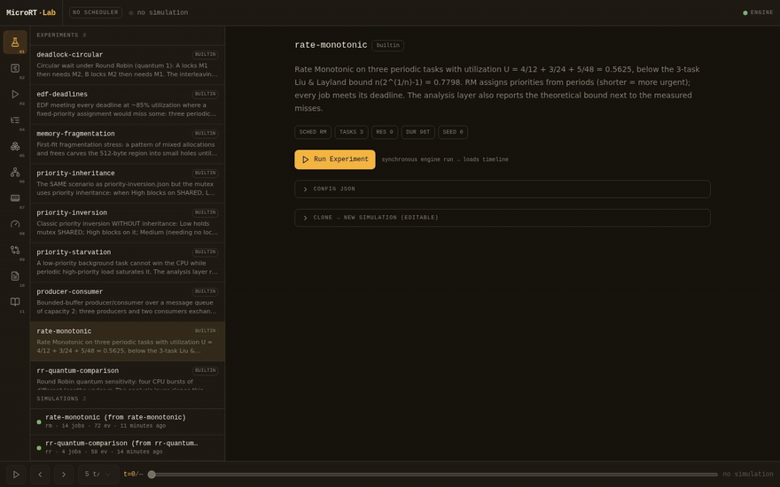

# MICRORT-LAB — آزمایشگاه قطعی زمان‌بندی و سیستم‌عامل Real-Time

[](https://github.com/ParsaFathii/MICRORT-LAB/actions/workflows/ci.yml)
[](https://github.com/ParsaFathii/MICRORT-LAB/releases)
[](../../LICENSE)

مستندات فارسی پروژه‌ی MicroRT-Lab

حق مالکیت © ۲۰۲۶ Parsa Fathi — مجوز Apache-2.0 — <https://github.com/ParsaFathii/MICRORT-LAB>

- [نسخه‌ی انگلیسی / English documentation](../../README.md)
- [دانلودها / Releases](https://github.com/ParsaFathii/MICRORT-LAB/releases) · [تغییرات / CHANGELOG](../../CHANGELOG.md)

---

## MicroRT-Lab چیست؟

MicroRT-Lab یک **آزمایشگاه شبیه‌سازی discrete-event قطعی (deterministic) برای مفاهیم زمان‌بندی و همگام‌سازی سیستم‌عامل** است. شما یک workload را به‌صورت JSON توصیف می‌کنید (تسک‌ها، الگوی release، برنامه‌ی گام‌به‌گام هر job، منابع مشترک، Scheduler و در صورت نیاز مدل حافظه)، موتور C++ آن را tick به tick اجرا می‌کند و یک سند نتیجه‌ی کامل و تکرارپذیر تحویل می‌دهد: trace رخدادها، timeline نوع Gantt، حسابداری per-task، metricهای تجمعی، بن‌بست‌های تشخیص‌داده‌شده و آمار allocator حافظه. لایه‌ی تحلیل Python آزمایش‌ها را مدیریت می‌کند، metricها را دوباره محاسبه می‌کند (به‌عنوان cross-check)، واریانت‌های مختلف Scheduler را مقایسه می‌کند و گزارش تولید می‌کند؛ و رابط کاربری وب (simulation workstation) همین داده‌ها را با timeline، playback، نمودار RAG بن‌بست و نقشه‌ی حافظه نمایش می‌دهد.

## چه چیزی نیست

- **یک هسته‌ی سیستم‌عامل production نیست.** لایه‌ی `kernel/` (به زبان C) مجموعه‌ای کوچک و با ظرفیت ثابت از primitiveهای سبک kernel است (TCB، صف آماده، Mutex، Semaphore، صف پیام، Event Flags و allocator حافظه) که برای شبیه‌سازی ساخته شده، نه برای بوت‌کردن سخت‌افزار.
- **یک سیستم Real-Time واقعی بر پایه‌ی ساعت فیزیکی نیست.** نه timer interrupt داریم، نه زمان‌بندی واقعی CPU و نه تضمین latency. «Real-Time» در این‌جا به **نظریه‌ی زمان‌بندی** ای اشاره دارد که مدل می‌شود (Deadline، RM/EDF و کران‌های Utilization)، در tickهای صحیحِ شبیه‌سازی‌شده.

## مسئله‌ای که حل می‌کند

مطالعه‌ی زمان‌بندی و همگام‌سازی با demoهای زنده به‌سختی قابل اتکاست:

- یک demo واقعی (threadهای واقعی روی سیستم‌عامل واقعی) به Scheduler میزبان، وضعیت cache و بار ماشین وابسته است؛ اجرای «همان» demo هر بار interleaving متفاوتی می‌دهد و رخدادهای مهم (priority inversion، deadlock یا miss شدن deadline) شاید اصلاً رخ ندهند.
- نمودارهای Gantt کتاب‌خانه‌ای فقط **نتیجه** را نشان می‌دهند، نه **مکانیزم** را: کدام رخداد باعث preemption شد، کدام waiter اول بیدار شد، صف چطور تکامل یافت.

MicroRT-Lab این را با شبیه‌سازی discrete-event جایگزین می‌کند: **همان config + همان seed ⇒ سند نتیجه‌ی بایت‌به‌بایت یکسان** (به‌جز فیلد زمان اجرای خود موتور، `wallMicros`). هر اجرا قابل replay، فیلتر، اندازه‌گیری، cross-check و مقایسه است. بهای این قطعیت، وفاداریِ کمتر به سخت‌افزار واقعی است: context switch یک هزینه‌ی ثابتِ tick است، I/O صرفاً یک تأخیر است و فقط یک CPU شبیه‌سازی می‌شود.

## معماری در یک نگاه

دموی ۴۰ ثانیه‌ای از عملکرد ایستگاه کاری (اجرای آزمایش ← پخش Gantt ← مرورگر trace ← متریک‌ها ← مقایسه‌ی زنده‌ی زمان‌بندها) — ضبط‌شده از خود برنامه:



```
experiments/*.json ─▶ kernel/ (C11)  ─▶ engine/ (C++20)  ─▶ services/api/ (Python 3.12)  ─▶ src/ (Next.js 16)
   config JSON          TCB, صف آماده،    event queue، ۸ زمان‌بند،   مدیریت آزمایش، تحلیل،      workstation وب:
   + seed               mutex/sem/msgq/   trace/gantt/metrics،       مقایسه و گزارش (FastAPI)   timeline، playback،
                        evflags، حافظه    تشخیص deadlock                                        RAG، نقشه‌ی حافظه
```

- **kernel/ (C11):** مدل سطح‌پایین task و همگام‌سازی؛ آرایه‌های با ظرفیت ثابت، بدون تخصیص dynamic — همان جایی که semantics آنچه مطالعه می‌کنید در آن زندگی می‌کند.
- **engine/ (C++20):** هسته‌ی شبیه‌سازی؛ event queue، مفسر برنامه‌ی ۱۳ op، ۸ Scheduler، هزینه‌ی context switch، تشخیص deadlock با RAG، aging، و تولید سند نتیجه. برای byte-determinism از containerهای unordered پرهیز می‌شود.
- **services/api/ (Python 3.12 + FastAPI):** مدیریت آزمایش، اجرای subprocess موتور، اعتبارسنجی pydantic، بازمحاسبه‌ی metricها، تحلیل نظری RM/EDF، مقایسه و گزارش.
- **src/ (TypeScript + React):** نمایش داده‌ها. **UI هرگز نتیجه‌ی Scheduler را محاسبه نمی‌کند** — همه‌ی اعداد از موتور یا لایه‌ی تحلیل می‌آیند.

شرح کامل معماری و جریان داده: [ARCHITECTURE_FA.md](ARCHITECTURE_FA.md)

## مفاهیم پشتیبانی‌شده

- **مدل task:** سه نوع `aperiodic` / `periodic` / `sporadic`؛ اولویت −۱۰۰ تا ۱۰۰ (بزرگ‌تر = فوری‌تر)؛ شش وضعیت: `READY`, `RUNNING`, `BLOCKED`, `WAITING`, `SLEEPING`, `TERMINATED`
- **۸ Scheduler:** `fifo`, `rr` (quantum پیش‌فرض ۴), `priority`, `priority_p`, `sjf`, `srtf`, `rm`, `edf`
- **۱۳ گام برنامه:** `cpu`, `io`, `sleep`, `lock`, `unlock`, `wait`, `signal`, `send`, `recv`, `evwait`, `evset`, `alloc`, `free`
- **همگام‌سازی:** Mutex با hand-off و Priority Inheritance (گذرا در زنجیره‌ها)، Semaphore شمارنده، صف پیام کرانه‌دار، Event Flags با حالت `any`/`all`
- **تشخیص deadlock:** حلقه‌های RAG با رخدادهای `DEADLOCK` و نمایش گرافی
- **Priority Inversion و Inheritance:** با مقایسه‌ی همان workload با و بدون `protocol: "inherit"` (High به‌جای ۳۴ tick فقط ۹ tick در BLOCKED)
- **Starvation و Aging:** افزایش اولویت مؤثر با گذشت زمان انتظار در READY؛ نجات task کم‌اولویت (کاهش انتظار BG از ۱۴۵ به ۹۶ tick)
- **حافظه:** مدل `region` با سیاست‌های first/best/worst-fit و coalescing و fragmentation؛ مدل `pool` با blockهای ثابت و internal fragmentation

## ۹ آزمایش آماده

| آزمایش | مفهوم | نتیجه‌ی قابل مشاهده |
|---|---|---|
| `rr-quantum-comparison` | حساسیت Round Robin به quantum | با quantum=4: تعداد ۱۱ context switch؛ مقایسه با quantum ۲/۸/۱۶ در نمای Compare |
| `priority-starvation` | گرسنگی زیر `priority_p` | تسک BG با پرچم `starved` و ۱۴۵ tick انتظار در READY |
| `priority-inversion` | Priority Inversion بدون inheritance | تسک High عدد ۳۴ tick در وضعیت BLOCKED |
| `priority-inheritance` | همان سناریو با `protocol: "inherit"` | رخدادهای `LOCK_INHERIT` و کاهش block شدن High به ۹ tick |
| `producer-consumer` | بافر کرانه‌دار با msgq | تناوب producer/consumer و hand-offهای مسدود، بدون بن‌بست |
| `deadlock-circular` | انتظار حلقوی | حلقه‌ی A→M2→B→M1 در t=۴ و بن‌بست تا افق شبیه‌سازی |
| `memory-fragmentation` | allocator منطقه‌ای با first-fit | ۳۷ خطای allocation و ۷ leak و fragmentation تا ۱۶۰ بایت |
| `edf-deadlines` | EDF و Deadline در U≈۰٫۹۲ | ۲۴ از ۲۴ job بدون هیچ miss (بالاتر از کران ۰٫۷۷۹۸) |
| `rate-monotonic` | RM و کران Utilization | U=۰٫۵۶۲۵ < کران Liu & Layland؛ ۱۴ job بدون miss |

## شروع سریع

```bash
# ساخت هسته و موتور (پیش‌نیاز: gcc 14+، CMake ≥ 3.16)
bash scripts/build-native.sh          # خروجی: engine/build/engine/micrort-engine

# سرویس تحلیل (پورت 3031)
cd services/api
python3 -m uvicorn app.main:app --host 127.0.0.1 --port 3031

# رابط کاربری (پورت 3000)
bun install && bun run dev
```

راهنمای گام‌به‌گام: [INSTALLATION_FA.md](INSTALLATION_FA.md) · [USER_GUIDE_FA.md](USER_GUIDE_FA.md)

## وضعیت تست و کارایی

- `ctest`: **۱۱/۱۱** مجموعه‌ی تست سبز (۵ suite هسته + ۶ suite موتور)؛ `selftest` موتور ۵۴ check
- `pytest` لایه‌ی API: **۹۷ تست** سبز (با باینری واقعی موتور)
- زمان اجرای هر آزمایش آماده: **۲ تا ۳ میلی‌ثانیه**؛ سند نتیجه: ۶ تا ۷۲ کیلوبایت
- قطعیت: اجرای دوباره‌ی همان config ⇒ سند بایت‌به‌بایت یکسان (فقط `wallMicros` متفاوت است)

## مستندات فارسی

| سند | موضوع |
|---|---|
| [INSTALLATION_FA.md](INSTALLATION_FA.md) | پیش‌نیازها، ساخت و اجرا روی هر پلتفرم |
| [USER_GUIDE_FA.md](USER_GUIDE_FA.md) | اجرای آزمایش‌ها، خواندن timeline و playback، مقایسه، تحلیل، گزارش |
| [ARCHITECTURE_FA.md](ARCHITECTURE_FA.md) | معماری لایه‌ای، چرایی انتخاب هر زبان، جریان داده |
| [SCHEDULING_FA.md](SCHEDULING_FA.md) | هشت Scheduler، قواعد tie-breaking، تحلیل نظری RM/EDF |
| [SYNCHRONIZATION_FA.md](SYNCHRONIZATION_FA.md) | Mutex، Semaphore، صف پیام، Event Flags، سناریوهای کلاسیک |
| [DEADLOCK_FA.md](DEADLOCK_FA.md) | مدل RAG، تشخیص حلقه، چهار شرط کلاسیک بن‌بست |
| [MEMORY_FA.md](MEMORY_FA.md) | مدل region و pool، fragmentation، سناریوی عملی |
| [API_FA.md](API_FA.md) | جدول endpointها، مثال‌های curl، فرمت خطاها |
| [DEVELOPMENT_FA.md](DEVELOPMENT_FA.md) | ساختار پروژه، قراردادهای schema، تست‌ها، افزودن زمان‌بند جدید |
| [COPYRIGHT_FA.md](COPYRIGHT_FA.md) | حق مالکیت، مجوز Apache-2.0، NOTICEهای شخص ثالث |

مستندات انگلیسی و قراردادهای رسمی داده: [README اصلی](../../README.md) ·
[SIMULATION_SCHEMA.md](../spec/SIMULATION_SCHEMA.md) ·
[FRONTEND_ARCHITECTURE.md](../spec/FRONTEND_ARCHITECTURE.md) ·
[docs/dev/SETUP.md](../dev/SETUP.md)
